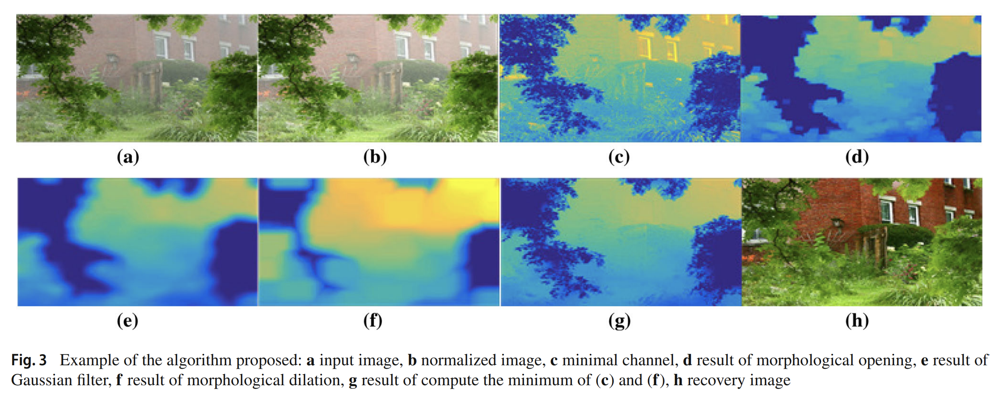

# Image dehazing using morphological opening, dilation and Gaussian filtering

> **Abstract:** 
Image pre-processing is a critical stage in computer vision systems, with greater relevance when the input images are captured in outdoor environments because the pictures could contain low contrast and modified colors. A common condition present in outdoor images is haze. In this work, a new dehazing algorithm based on dark channel prior mathematical morphology operations (opening and dilation), and a Gaussian filter, is proposed. Moreover, the proposed algorithm performance is compared qualitatively and quantitatively against previously reported algorithms. Obtained results show that the proposed algorithm requires less processing time providing higher quality dehazing results than other state-of-the-art approaches.

- [Paper](https://link.springer.com/article/10.1007/s11760-018-1286-9)

## Notes
1. Our implementation of the paper.
2. Send email to maldonadoq.percy@gmail.com if you have critical issues to be addressed.
